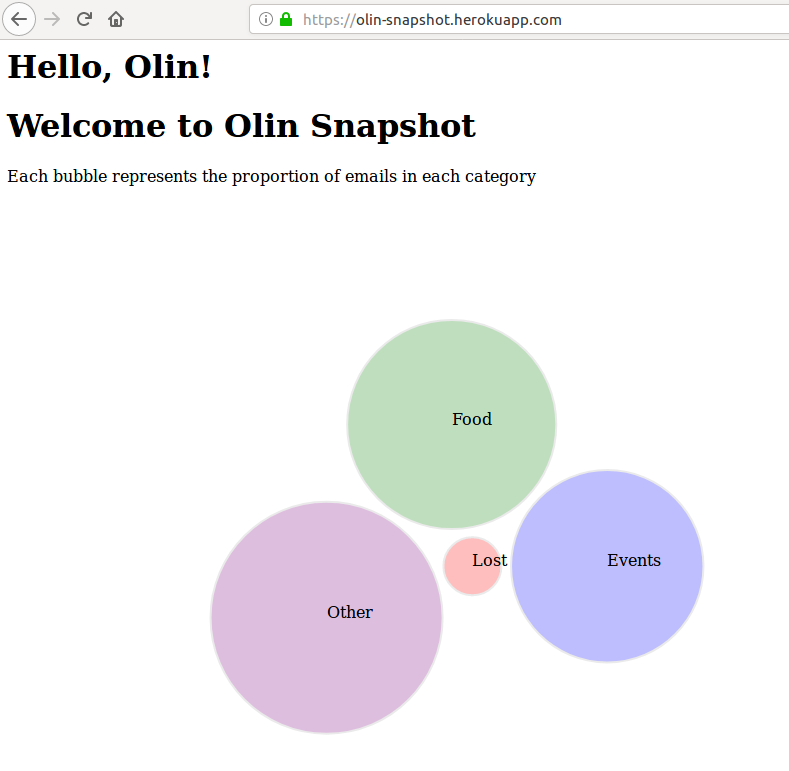

# OlinSnapshot

Takes emails from the HelpMe and CarpeDiem email lists at Olin College, scrapes and sorts them, and presents them in an interactive UI

You can find the results at our [main page](https://olin-snapshot.herokuapp.com/).



To view data from Postgres Database, go to the [data page](https://olin-snapshot.herokuapp.com/data).

## Contributors

Mackenzie Frackleton, Kaitlyn Keil, Isa Blancett, and Wilson Tang

## Contributions

Aloverso's heartbot at: https://github.com/aloverso/heartbot

## Requirements

* Python3
* Virtual Environment
* Heroku CLI
* Flask
* Pip
* psycopg2
* [postgresql](https://wiki.postgresql.org/wiki/Detailed_installation_guides)
* Linux or OSX? (Untested in Windows)

## Installing Virtual Environment, Heroku CLI, & Postgresql

### Virtual Environment

```shell
python3 -m pip install --user virtualenv
```

### Heroku CLI

For Linux:

```shell
wget -qO- https://cli-assets.heroku.com/install-ubuntu.sh | sh
```

For OSX:

```shell
brew install heroku/brew/heroku
```

### Postgresql

For Linux:

```shell
sudo apt-get update
sudo apt-get install postgresql postgresql-contrib
```

For OSX:

```shell
brew install postgresql
```

## Setting up Outlook & Gmail for POP

We are using a Gmail account that is forwarded emails from an Outlook account.  How you set up this account may be specific to the clients you are using.  If you are using Gmail, make sure that 'POP' and 'allow access from less secure apps' are both enabled.  Please email isabel.blancett@students.olin.edu if you have any questions regarding this step.

On your Gmail account:

1. Settings>Forwarding and POP/IMAP>Enable POP for all mail
2. My Account>Apps with account access(under Sign-in & Security)>Allow Less Secure Apps

## Getting Started

To clone and setup virtual environment:

```shell
git clone https://github.com/KaitlynKeil/OlinSnapshot.git
cd OlinSnapshot
virtualenv venv
source venv/bin/activate
pip install -r requirements.txt
```

Create a heroku app `heroku create appname` and run git remote `heroku git:remote -a <app name>` to link.  Make sure to give your app a unique name, because 'olin-snapshot' is taken by us!

### Initializing Database

In order to set up a database in Heroku, use `heroku addons` to make sure it does not already exist. If heroku-postgresql appears in the app's list of add-ons, you can move on. Otherwise, you can provision it with the command `heroku addons:create heroku-postgresql:<PLAN_NAME>`. hobby-dev as a plan should be enough. Use `heroku config` to make sure you have a DATABASE_URL variable. If more help is needed, you can [read about provisioning heroku postgres at this link](https://devcenter.heroku.com/articles/heroku-postgresql#provisioning-heroku-postgres).

Once you have done this, set up the database by running

```shell 
python3 -m app.set_up_database
```

and create an environment variable DATABASE_URL by running

```shell
export DATABASE_URL=<copy and paste the value from heroku config here>
```

Once this has been created, run `python3 app/set_up_database.py` in order to initialize your database. This will create a schema called 'emails' with three tables:
-msg: contains the email information, such as the subject (name), body, event_place (location if specified), value (integer that defaults to 5), who (sender), and msg_id (unique serial)
-cats: contains category names (Food, Event, Lost, and Other) and their corresponding cat_id (serial)
-msg_to_cat: join table that contains two columns. msg_id corresponds to the email serial. cat_id corresponds to the category. For each email, there is an entry for each category. Thus, if we are looking at email 5, which is both Food (cat_id 1) and Lost (cat_id 3), msg_to_cat would have two rows: 5 1 and 5 3.

The database should now be set up. 

### Running locally

To run simple flask app on local host:

```shell
heroku config -a <app name>
export DATABASE_URL=<value from heroku config DATABASE_URL>
export SNAPSHOT_EMAIL=<your gmail>
export SNAPSHOT_PASS=<your password>

export FLASK_APP=olinsnapshot.py
flask run
```

## Deployment to Heroku

```shell
heroku config:set SNAPSHOT_EMAIL=<your gmail> SNAPSHOT_PASS=<your pass>
git add .
git commit -am "Initializing heroku app"
git push heroku master
heroku open
```

Deployed to: https://appname.herokuapp.com/

## Issues
- D3 cannot currently handle user events (clicks)
- Email scraper grabs Outlook account as original sender of the email
- Email content is littered with formatting
- Date & Time objects are not supported
- No iCal support
